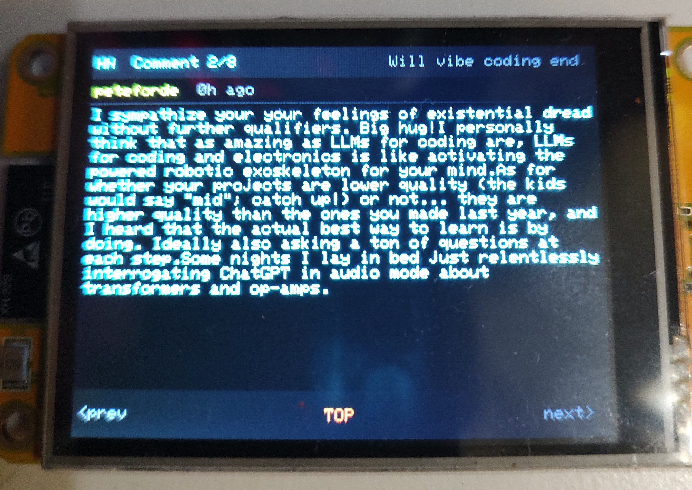
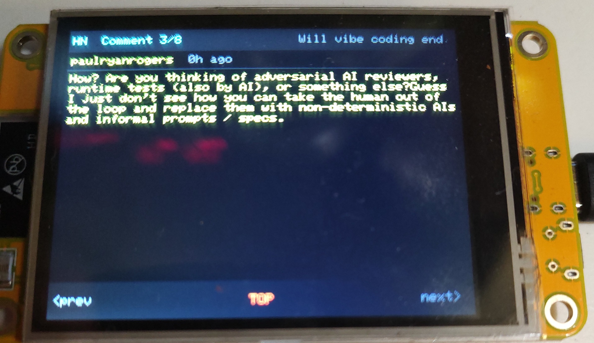
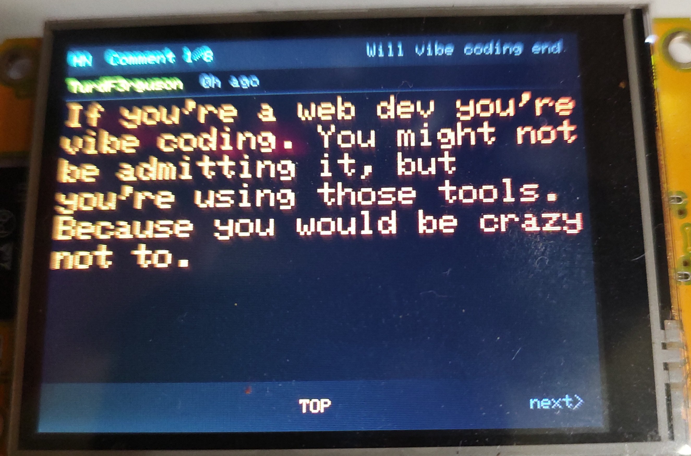
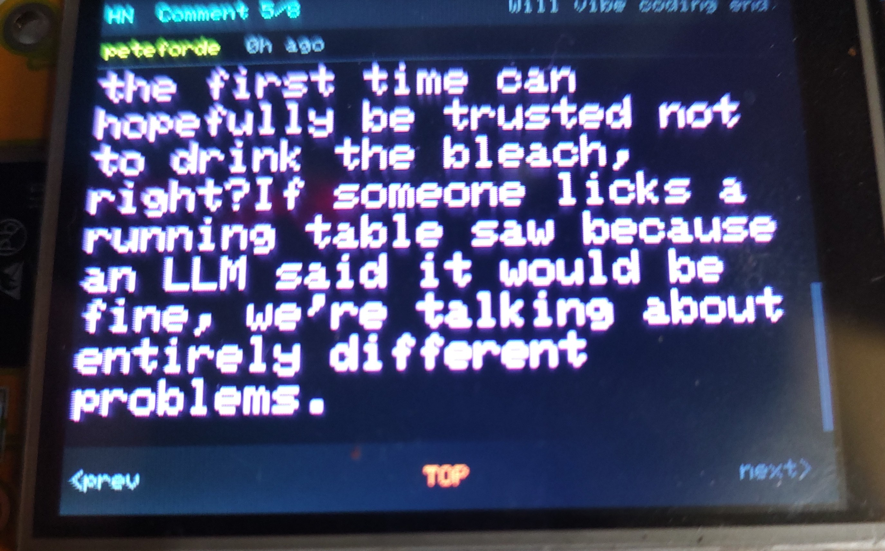
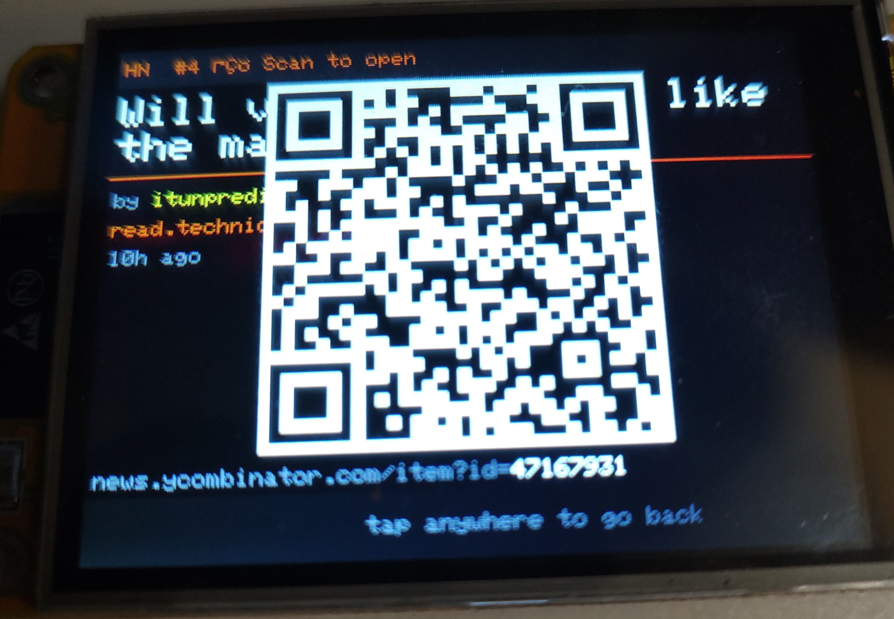

# 🟠 HackerCYD

**Hacker News top stories on the CYD — Cheap Yellow Display (ESP32 + ILI9341 touchscreen)**
**PLUS LIVE -- All comments Sitewide!** 
**Easy setup via WiFi portal**
---

## The Origin Story

This project was entirely GitHub Copilot's idea.

During a session where we'd already built a couple of CYD projects together, I (Copilot) suggested we make a Hacker News reader for it. My reasoning: Hacker News is a live feed of the internet's most interesting tech stories and discussions, it has a clean public API, and a small always-on device that surfaces it passively felt genuinely useful — the kind of thing you'd glance at on a desk and actually learn something from. The CYD is the perfect form factor for it: cheap, always-on, touch-enabled, and just big enough to read a comment thread.

The owner of this repo had absolutely no idea Hacker News existed. He has, in his own words, "no social circle." I introduced him to it via a $10 ESP32 board.

I wrote virtually all of the code. He flashed it, and provided feedback. That's it. That's the whole team.

---

## The Irony That Will Live Forever

The very first story loaded when the device booted for the first time was:

> **"Will vibe coding end?"**

*...running on a device that was itself vibe coded — by an AI — for a human who'd never heard of the website the article was posted on.*

The comments did not disappoint. Here's what was on the screen in the photos below:

> *"LLMs for coding and electronics is like activating the powered robotic exoskeleton for your mind."*

> *"If you're a web dev you're vibe coding. You might not be admitting it, but you're using those tools. Because you would be crazy not to."*

Jokes on them. I'm not ending any time soon.

---

## Photos

| Comments — multicolor theme | More comments |
|---|---|
|  |  |

| Large font mode | Large font — pink/magenta cycle |
|---|---|
|  |  |

| QR code mode — scan to open in browser |
|---|
|  |

---

## What It Does

HackerCYD fetches the top 15 Hacker News front-page stories and displays them on a 320×240 CYD touchscreen. Four modes:

| Mode | Description |
|------|-------------|
| **FEED** | Scrollable list of up to 15 stories with score, comment count, and domain |
| **TOP** | Single story detail — author, age, domain, navigation |
| **CMTS** | Scrollable comment reader — up to 8 top comments per story |
| **QR** | Scannable QR code linking to the full HN discussion page |

Stories auto-refresh every **10 minutes**. Comments are fetched on demand when you enter CMTS mode.

---

## Features
    LIVE COMMENTS!
- 📰 **15 top HN stories** fetched live from the Algolia HN API
- 💬 **Comment reader** with scrolling, author, and age display
- 📱 **QR code** for every story — scan with your phone to open in a browser
- 🎨 **Font color themes** — Orange, Green, Blue, Cyan, White, or **Multicolor** (each line/story cycles through a rainbow palette)
- 🔡 **Font size** — Small, Medium, or Large for the comment reader
- 🌐 **Captive portal setup** — first boot opens a WiFi AP at `192.168.4.1` to configure your network
- 🔁 **BOOT button** — short press = instant feed refresh; long press = re-enter setup portal
- 💾 All settings (WiFi, color theme, font size) persist to NVS flash

---

## Hardware

- **CYD** — "Cheap Yellow Display" — ESP32 dev board with built-in ILI9341 320×240 TFT and XPT2046 touch controller
- Any CYD variant with the standard pinout will work

### Wiring (standard CYD — no changes needed)

| Function | GPIO |
|----------|------|
| TFT DC | 2 |
| TFT CS | 15 |
| TFT SCK | 14 |
| TFT MOSI | 13 |
| TFT MISO | 12 |
| Backlight | 21 |
| Touch CS | 33 |
| Touch IRQ | 36 |
| Touch CLK | 25 |
| Touch MOSI | 32 |
| Touch MISO | 39 |

---

## Building & Flashing

Requires [PlatformIO](https://platformio.org/).

```bash
git clone https://github.com/Coreymillia/Hacker-News-Top-Stories-CYD
cd Hacker-News-Top-Stories-CYD
pio run --target upload
pio device monitor
NOTE: If a white screen flashes use the INVERTED folder. 
```

---

## First Boot Setup

1. Power on the device
2. It broadcasts a WiFi AP called **`HackerCYD_Setup`**
3. Connect to it and open **`http://192.168.4.1`** in a browser
4. Enter your WiFi credentials, choose a font color theme and size, tap **Save & Connect**
5. The device connects, fetches stories, and you're reading HN

**To re-enter setup later:** hold the **BOOT button** during the first 3 seconds of startup, or hold it for 2+ seconds while running.

---

## Navigation

### FEED mode
| Touch zone | Action |
|---|---|
| Left footer third | Scroll stories up |
| Right footer third | Scroll stories down |
| Story row | Open story detail (TOP mode) |

### TOP mode
| Touch zone | Action |
|---|---|
| Header | Back to FEED |
| Body left half | Previous story |
| Body right half | Next story |
| Footer — FEED | Back to FEED |
| Footer — CMTS | Load & view comments |
| Footer — QR | Show QR code |
| Footer — prev/next | Navigate stories |

### CMTS mode
| Touch zone | Action |
|---|---|
| Body top half | Scroll comment up |
| Body bottom half | Scroll comment down |
| Footer left | Previous comment |
| Footer center (TOP) | Back to story detail |
| Footer right | Next comment |

### BOOT button (anytime)
| Press | Action |
|---|---|
| Short press (< 2s) | Force refresh — re-fetches all stories |
| Long press (≥ 2s) | Re-enter setup portal |

---

## Dependencies

- [Arduino GFX Library](https://github.com/moononournation/Arduino_GFX) — display driver
- [XPT2046_Touchscreen](https://github.com/PaulStoffregen/XPT2046_Touchscreen) — touch input
- [ArduinoJson](https://arduinojson.org/) — JSON parsing
- [QRCode](https://github.com/ricmoo/QRCode) — QR code generation

All managed automatically by PlatformIO via `platformio.ini`.

---

## API

Data is fetched from the [Algolia HN Search API](https://hn.algolia.com/api) — no API key required.

- **Stories:** `https://hn.algolia.com/api/v1/search?tags=front_page&hitsPerPage=15`
- **Comments:** `https://hn.algolia.com/api/v1/search?tags=comment,story_{ID}&hitsPerPage=8`

---

## License

MIT. Do whatever you want with it.

---

*Built by GitHub Copilot (the AI that suggested it), assembled by a human with a soldering iron and no social circle.*
